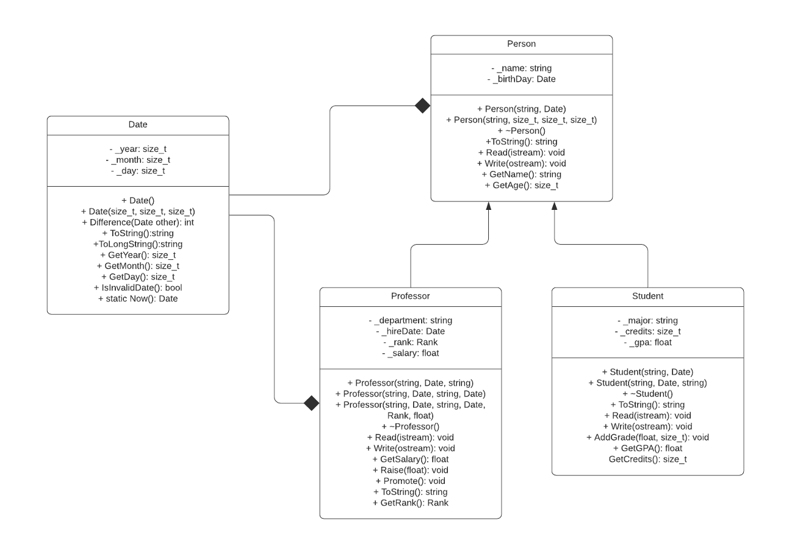
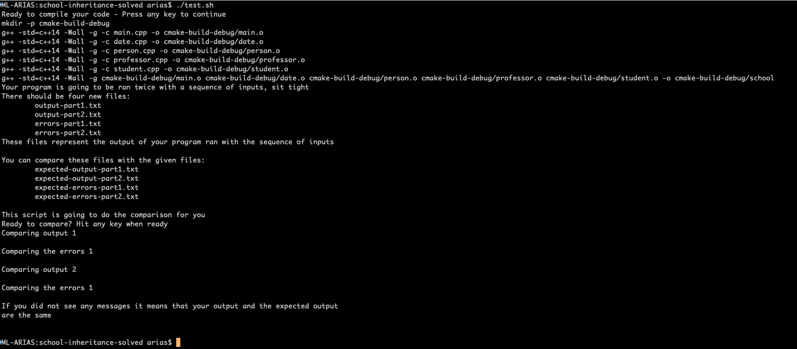

# Inheritance Lab
Inheritance Lab Definition (People-Student-Professor)
This lab will help you practice the following concepts:
- Inheritance
- Polymorphism
- STL's `vector` class


## Given
You will be given the following files:
- `main.cpp` contains the main function stub and the implemented `Menu` function
- `date.h` and `date.cpp` contain the class `Date` declaration and definition. This class is
 ready to use.
- `makefile` the instructions to compile in the command line. Just type `make` and the
 makefile will tell the make utility how to compile the code. Your executable is going to be
  in the `cmake-build-debug` directory, to execute: `cmake-build-debug\school`

## The Class Family
The following image shows the relationship between the classes you will need to code. Note
 that the Date class is already given to you, and you are ready to use it. The only caveat
  with that class is that `valgrind` does not seem to like how memory is handled there, but you
   can ignore those messages.



## Classes Description

### Person
Members | Description 
---------|-----------
`string _name` | Represents the name of the person (no spaces to simplify Read operation)
`Date _birthday` | The birthday of the person
`Person(const string& name, const Date& birthday);` | Constructor for Person, remember to take advantage of the initialization syntax
`Person(const string& name, size_t year, size_t month, size_t day);` | Constructor for Person, remember to take advantage of the initialization syntax
`~Person();` | Make sure to make your destructor virtual in all classes (we will discuss why later). No need to add any code here.
`string ToString()const;` | Returns a `string` representation of the Person in JSON format: `{name: XXXXX, birthday: {year: 9999, month: 9, day: 9}}`
`void Read(istream& input);` | Reads a person from the `input` stream, each field is separated by whitespace (space, tab or enter)
`void Write(ostream& output)const;` | Writes the person data to the `output` stream. It writes each member separated by space.
`string GetName()const;` | Returns the name of the person.
`size_t GetAge()const;` | Returns the age in years of the person.

### Student
Members | Description 
---------|-----------
`string _major;` | represents the major of the student, by default is _undecided_
`size_t _credits;` | number of credits registered by the student, starts at 0
`float _gpa;` | the current gpa of the student in [0, 4] format, it starts at 0.0
`Student(const string& name, const Date& birthday);` | Constructor, initializes the student with default values 
`Student(const string& name, const Date& birthday, const string& major);` | Constructor, sets the major of the student
`~Student();` | Destructor, empty body
`string ToString()const;` | Returns the string representation of the student in JSON format: `{Person: {name: XXX, birthday: {year: 9999, month: 9, day: 9}}, major: XXX, credits: 9, gpa: 9.9}`
`void Read(istream& input);` | Reads a student from `input` stream. Attributes separated by space
`void Write(ostream& output)const;` | Writes a student to `output` stream. Attributes separated by space
`void AddGrade(float grade, size_t credits);` | Adds a grade with its number of credits, it updates the GPA and the number of credits of the student
`float GetGPA()const;` | returns the GPA of the student
`size_t GetCredits()const;` | returns the number of credits registered by the student

Sample GPA Calculation
1. The student has the starting values: `_gpa=0.0`, `_credits=0`
1. A grade is added to his record: Grade = 3.5 with 5 credits, this updates the object's
 values: `_gpa=3.5`, `_credits=5`
1. An additional grade is added to his record: Grade = 2.0 with 1 credit, this updates the
 object's values `_gpa=3.25`, `_credits=6`

### Professor
Members | Description 
--------|-----------
`string _department;` | the department to which the professor works for
`Date _hireDate;` | the date the professor was hired
`Rank _rank;` | represents the rank of the professor, see below for the definition of type `Rank`
`float _salary;` | represents the annual salary of the professor
`Professor(const string& name, const Date& birthday, const string& department);` | Initializes the professor using today as hire date, rank as assistant professor and initial salary as 60,000.
`Professor(const string& name, const Date& birthday, const string& department, const Date & hireDate);` | Initializes the professor using the hire date to determine rank and salary. See below for instructions.
`Professor(const string& name, const Date& birthday, const string& department, const Date& hireDate, Rank rank, float salary);` | Initializes the professor with all attributes.
`~Professor();` | Destructor, no code in it.
`string ToString()const;` | returns a string representation of the professor using JSON format, `{Person: {name: XXX, birthday: {year: 9999, month: 9, day: 9}}, department: XXX, rank: 9, hire-date: {year: 9999, month: 9, day: 9}, salary: 999.99}`
`void Read(istream& input);` | reads a professor from the `input` stream. The attributes are separated by space.
`void Write(ostream& output)const;` | writes a professor to the `output` stream. The attributes are separated by spaces. 
`void Raise(float percentage);` | increases the salary of the professor by the given percentage. If the increase is 15% then the parameter value should be 0.15
`void Promote();` | promotes the professor to the next rank, unless the professor is already at the highest rank
`Rank GetRank()const;` | returns the rank of the professor, see below for the definition of type `Rank`
`float GetSalary()const;` | returns the salary of the professor

**Rank**

It is enum declared as follows:
```C++
enum Rank {ASSISTANT_PROFESSOR, ASSOCIATE_PROFESSOR, PROFESSOR};
```

**Initialization of a Professor**

The professor rank and salary is determined on the date the professor was hired. The rules
 are as follows:
Professors with less than 5 years, their rank is Assistant Professor, their annual salary is
 $60,000; professors with 5 years to less than 10 years, their rank is Associate Professor
 , their annual salary is $70,000; professors with more than 10 years their rank is
  Professor, their annual salary is $75,000

### About the file
To store the information in the file, and to be able to retrieve it, store each instance
 with a prefix letter to indicate what class your are storing. For example:
 ```text
P Peter 1995 10 1
P Janice 1991 2 21
S Ann 2000 3 19 BUS 8 3.59375
R Josh 1980 1 15 BUS 2010 9 1 2 70000
S Pat 2002 6 19 CSC 3 3
R Daphne 1995 9 4 BIO 2018 9 1 1 62100
```
- P for Person, and then its attributes separated by space
- S for Student, and then its attributes separated by space
- R for Professor, and then its attributes separated by space
  
## Reminders
- Check Canvas for the expected programming practices
- Your program should not crash under any circumstances. The user can input anything and it
 should never crash!
- Check your memory with `valgrind`

## Run Example
This is a sample run of the program, your program could be tested with different values.
```
ML-ARIAS:school-inheritance-solved arias$ cmake-build-debug/school
-------------------------------------------
1. Add a Person
2. Add a Student
3. Add a Professor
4. List all People
5. Show Students Report
6. Show Professors Report
7. Show People (not Professors or Students)
8. Calculate all Students Average GPA
9. Calculate all Professors Average Salary
10. Input Grades to Student
11. Promote Professor
12. Give Raise to Professor
13. Load Data from File
14. Write Data to File
15. Exit
wrong
Incorrect input!
-------------------------------------------
1. Add a Person
2. Add a Student
3. Add a Professor
4. List all People
5. Show Students Report
6. Show Professors Report
7. Show People (not Professors or Students)
8. Calculate all Students Average GPA
9. Calculate all Professors Average Salary
10. Input Grades to Student
11. Promote Professor
12. Give Raise to Professor
13. Load Data from File
14. Write Data to File
15. Exit
16
Incorrect menu option!
-------------------------------------------
1. Add a Person
2. Add a Student
3. Add a Professor
4. List all People
5. Show Students Report
6. Show Professors Report
7. Show People (not Professors or Students)
8. Calculate all Students Average GPA
9. Calculate all Professors Average Salary
10. Input Grades to Student
11. Promote Professor
12. Give Raise to Professor
13. Load Data from File
14. Write Data to File
15. Exit
1

Name: Peter
Birth date yyyy mm dd: 1995 10 1
Person inserted in position: 0

-------------------------------------------
1. Add a Person
2. Add a Student
3. Add a Professor
4. List all People
5. Show Students Report
6. Show Professors Report
7. Show People (not Professors or Students)
8. Calculate all Students Average GPA
9. Calculate all Professors Average Salary
10. Input Grades to Student
11. Promote Professor
12. Give Raise to Professor
13. Load Data from File
14. Write Data to File
15. Exit
1

Name: Janice
Birth date yyyy mm dd: 1991 2 31
Invalid Date!
Birth date yyyy mm dd: 1991 2 21
Person inserted in position: 1

-------------------------------------------
1. Add a Person
2. Add a Student
3. Add a Professor
4. List all People
5. Show Students Report
6. Show Professors Report
7. Show People (not Professors or Students)
8. Calculate all Students Average GPA
9. Calculate all Professors Average Salary
10. Input Grades to Student
11. Promote Professor
12. Give Raise to Professor
13. Load Data from File
14. Write Data to File
15. Exit
2

Name: Ann
Birth date yyyy mm dd: 2000 3 19
Major: BUS
Student inserted in position: 2

-------------------------------------------
1. Add a Person
2. Add a Student
3. Add a Professor
4. List all People
5. Show Students Report
6. Show Professors Report
7. Show People (not Professors or Students)
8. Calculate all Students Average GPA
9. Calculate all Professors Average Salary
10. Input Grades to Student
11. Promote Professor
12. Give Raise to Professor
13. Load Data from File
14. Write Data to File
15. Exit
3

Name: Josh
Birth date yyyy mm dd: 1980 01 15
Department: BUS
Hire date yyyy mm dd: 2010 09 1
Professor inserted in position: 3

-------------------------------------------
1. Add a Person
2. Add a Student
3. Add a Professor
4. List all People
5. Show Students Report
6. Show Professors Report
7. Show People (not Professors or Students)
8. Calculate all Students Average GPA
9. Calculate all Professors Average Salary
10. Input Grades to Student
11. Promote Professor
12. Give Raise to Professor
13. Load Data from File
14. Write Data to File
15. Exit
2

Name: Pat
Birth date yyyy mm dd: 2002 6 19
Major: CSC
Student inserted in position: 4

-------------------------------------------
1. Add a Person
2. Add a Student
3. Add a Professor
4. List all People
5. Show Students Report
6. Show Professors Report
7. Show People (not Professors or Students)
8. Calculate all Students Average GPA
9. Calculate all Professors Average Salary
10. Input Grades to Student
11. Promote Professor
12. Give Raise to Professor
13. Load Data from File
14. Write Data to File
15. Exit
4

{name: Peter, birthday: {year: 1995, month: 10, day: 1}}
{name: Janice, birthday: {year: 1991, month: 2, day: 21}}
{Person: {name: Ann, birthday: {year: 2000, month: 3, day: 19}}, major: BUS, gpa: 0, credits: 0}
{Person: {name: Josh, birthday: {year: 1980, month: 1, day: 15}}, department: BUS, rank: 1, hire-date: {year: 2010, month: 9, day: 1}, salary: 70000}
{Person: {name: Pat, birthday: {year: 2002, month: 6, day: 19}}, major: CSC, gpa: 0, credits: 0}
-------------------------------------------
1. Add a Person
2. Add a Student
3. Add a Professor
4. List all People
5. Show Students Report
6. Show Professors Report
7. Show People (not Professors or Students)
8. Calculate all Students Average GPA
9. Calculate all Professors Average Salary
10. Input Grades to Student
11. Promote Professor
12. Give Raise to Professor
13. Load Data from File
14. Write Data to File
15. Exit
5

{Person: {name: Ann, birthday: {year: 2000, month: 3, day: 19}}, major: BUS, gpa: 0, credits: 0}
{Person: {name: Pat, birthday: {year: 2002, month: 6, day: 19}}, major: CSC, gpa: 0, credits: 0}
-------------------------------------------
1. Add a Person
2. Add a Student
3. Add a Professor
4. List all People
5. Show Students Report
6. Show Professors Report
7. Show People (not Professors or Students)
8. Calculate all Students Average GPA
9. Calculate all Professors Average Salary
10. Input Grades to Student
11. Promote Professor
12. Give Raise to Professor
13. Load Data from File
14. Write Data to File
15. Exit
6

{Person: {name: Josh, birthday: {year: 1980, month: 1, day: 15}}, department: BUS, rank: 1, hire-date: {year: 2010, month: 9, day: 1}, salary: 70000}
-------------------------------------------
1. Add a Person
2. Add a Student
3. Add a Professor
4. List all People
5. Show Students Report
6. Show Professors Report
7. Show People (not Professors or Students)
8. Calculate all Students Average GPA
9. Calculate all Professors Average Salary
10. Input Grades to Student
11. Promote Professor
12. Give Raise to Professor
13. Load Data from File
14. Write Data to File
15. Exit
7

{name: Peter, birthday: {year: 1995, month: 10, day: 1}}
{name: Janice, birthday: {year: 1991, month: 2, day: 21}}
-------------------------------------------
1. Add a Person
2. Add a Student
3. Add a Professor
4. List all People
5. Show Students Report
6. Show Professors Report
7. Show People (not Professors or Students)
8. Calculate all Students Average GPA
9. Calculate all Professors Average Salary
10. Input Grades to Student
11. Promote Professor
12. Give Raise to Professor
13. Load Data from File
14. Write Data to File
15. Exit
10

2 {Person: {name: Ann, birthday: {year: 2000, month: 3, day: 19}}, major: BUS, gpa: 0, credits: 0}
4 {Person: {name: Pat, birthday: {year: 2002, month: 6, day: 19}}, major: CSC, gpa: 0, credits: 0}
Number of student to input grades to: 8
Position out of range!
Number of student to input grades to: 1
Person {name: Janice, birthday: {year: 1991, month: 2, day: 21}} is not a student
Number of student to input grades to: 2
Grade of the student [0.0 to 4.0 scale]: wrong
Incorrect input!
Grade of the student [0.0 to 4.0 scale]: 4.1
Invalid grade value, make sure [0.0, 4.0]
Grade of the student [0.0 to 4.0 scale]: 3.89
Credits {1, 2, 3, 4, 5}: 5
-------------------------------------------
1. Add a Person
2. Add a Student
3. Add a Professor
4. List all People
5. Show Students Report
6. Show Professors Report
7. Show People (not Professors or Students)
8. Calculate all Students Average GPA
9. Calculate all Professors Average Salary
10. Input Grades to Student
11. Promote Professor
12. Give Raise to Professor
13. Load Data from File
14. Write Data to File
15. Exit
5

{Person: {name: Ann, birthday: {year: 2000, month: 3, day: 19}}, major: BUS, gpa: 3.89, credits: 5}
{Person: {name: Pat, birthday: {year: 2002, month: 6, day: 19}}, major: CSC, gpa: 0, credits: 0}
-------------------------------------------
1. Add a Person
2. Add a Student
3. Add a Professor
4. List all People
5. Show Students Report
6. Show Professors Report
7. Show People (not Professors or Students)
8. Calculate all Students Average GPA
9. Calculate all Professors Average Salary
10. Input Grades to Student
11. Promote Professor
12. Give Raise to Professor
13. Load Data from File
14. Write Data to File
15. Exit
10

2 {Person: {name: Ann, birthday: {year: 2000, month: 3, day: 19}}, major: BUS, gpa: 3.89, credits: 5}
4 {Person: {name: Pat, birthday: {year: 2002, month: 6, day: 19}}, major: CSC, gpa: 0, credits: 0}
Number of student to input grades to: 2
Grade of the student [0.0 to 4.0 scale]: 3.1
Credits {1, 2, 3, 4, 5}: 3
-------------------------------------------
1. Add a Person
2. Add a Student
3. Add a Professor
4. List all People
5. Show Students Report
6. Show Professors Report
7. Show People (not Professors or Students)
8. Calculate all Students Average GPA
9. Calculate all Professors Average Salary
10. Input Grades to Student
11. Promote Professor
12. Give Raise to Professor
13. Load Data from File
14. Write Data to File
15. Exit
5

{Person: {name: Ann, birthday: {year: 2000, month: 3, day: 19}}, major: BUS, gpa: 3.59375, credits: 8}
{Person: {name: Pat, birthday: {year: 2002, month: 6, day: 19}}, major: CSC, gpa: 0, credits: 0}
-------------------------------------------
1. Add a Person
2. Add a Student
3. Add a Professor
4. List all People
5. Show Students Report
6. Show Professors Report
7. Show People (not Professors or Students)
8. Calculate all Students Average GPA
9. Calculate all Professors Average Salary
10. Input Grades to Student
11. Promote Professor
12. Give Raise to Professor
13. Load Data from File
14. Write Data to File
15. Exit
10

2 {Person: {name: Ann, birthday: {year: 2000, month: 3, day: 19}}, major: BUS, gpa: 3.59375, credits: 8}
4 {Person: {name: Pat, birthday: {year: 2002, month: 6, day: 19}}, major: CSC, gpa: 0, credits: 0}
Number of student to input grades to: 4
Grade of the student [0.0 to 4.0 scale]: 3
Credits {1, 2, 3, 4, 5}: 3
-------------------------------------------
1. Add a Person
2. Add a Student
3. Add a Professor
4. List all People
5. Show Students Report
6. Show Professors Report
7. Show People (not Professors or Students)
8. Calculate all Students Average GPA
9. Calculate all Professors Average Salary
10. Input Grades to Student
11. Promote Professor
12. Give Raise to Professor
13. Load Data from File
14. Write Data to File
15. Exit
5

{Person: {name: Ann, birthday: {year: 2000, month: 3, day: 19}}, major: BUS, gpa: 3.59375, credits: 8}
{Person: {name: Pat, birthday: {year: 2002, month: 6, day: 19}}, major: CSC, gpa: 3, credits: 3}
-------------------------------------------
1. Add a Person
2. Add a Student
3. Add a Professor
4. List all People
5. Show Students Report
6. Show Professors Report
7. Show People (not Professors or Students)
8. Calculate all Students Average GPA
9. Calculate all Professors Average Salary
10. Input Grades to Student
11. Promote Professor
12. Give Raise to Professor
13. Load Data from File
14. Write Data to File
15. Exit
8

The average GPA of the students is: 3.29688
-------------------------------------------
1. Add a Person
2. Add a Student
3. Add a Professor
4. List all People
5. Show Students Report
6. Show Professors Report
7. Show People (not Professors or Students)
8. Calculate all Students Average GPA
9. Calculate all Professors Average Salary
10. Input Grades to Student
11. Promote Professor
12. Give Raise to Professor
13. Load Data from File
14. Write Data to File
15. Exit
6

{Person: {name: Josh, birthday: {year: 1980, month: 1, day: 15}}, department: BUS, rank: 1, hire-date: {year: 2010, month: 9, day: 1}, salary: 70000}
-------------------------------------------
1. Add a Person
2. Add a Student
3. Add a Professor
4. List all People
5. Show Students Report
6. Show Professors Report
7. Show People (not Professors or Students)
8. Calculate all Students Average GPA
9. Calculate all Professors Average Salary
10. Input Grades to Student
11. Promote Professor
12. Give Raise to Professor
13. Load Data from File
14. Write Data to File
15. Exit
3

Name: Daphne
Birth date yyyy mm dd: 1995 9 4
Department: BIO
Hire date yyyy mm dd: 2018 9 1
Professor inserted in position: 5

-------------------------------------------
1. Add a Person
2. Add a Student
3. Add a Professor
4. List all People
5. Show Students Report
6. Show Professors Report
7. Show People (not Professors or Students)
8. Calculate all Students Average GPA
9. Calculate all Professors Average Salary
10. Input Grades to Student
11. Promote Professor
12. Give Raise to Professor
13. Load Data from File
14. Write Data to File
15. Exit
6

{Person: {name: Josh, birthday: {year: 1980, month: 1, day: 15}}, department: BUS, rank: 1, hire-date: {year: 2010, month: 9, day: 1}, salary: 70000}
{Person: {name: Daphne, birthday: {year: 1995, month: 9, day: 4}}, department: BIO, rank: 0, hire-date: {year: 2018, month: 9, day: 1}, salary: 60000}
-------------------------------------------
1. Add a Person
2. Add a Student
3. Add a Professor
4. List all People
5. Show Students Report
6. Show Professors Report
7. Show People (not Professors or Students)
8. Calculate all Students Average GPA
9. Calculate all Professors Average Salary
10. Input Grades to Student
11. Promote Professor
12. Give Raise to Professor
13. Load Data from File
14. Write Data to File
15. Exit
11

3 {Person: {name: Josh, birthday: {year: 1980, month: 1, day: 15}}, department: BUS, rank: 1, hire-date: {year: 2010, month: 9, day: 1}, salary: 70000}
5 {Person: {name: Daphne, birthday: {year: 1995, month: 9, day: 4}}, department: BIO, rank: 0, hire-date: {year: 2018, month: 9, day: 1}, salary: 60000}
Number of professor to promote: 3
-------------------------------------------
1. Add a Person
2. Add a Student
3. Add a Professor
4. List all People
5. Show Students Report
6. Show Professors Report
7. Show People (not Professors or Students)
8. Calculate all Students Average GPA
9. Calculate all Professors Average Salary
10. Input Grades to Student
11. Promote Professor
12. Give Raise to Professor
13. Load Data from File
14. Write Data to File
15. Exit
6

{Person: {name: Josh, birthday: {year: 1980, month: 1, day: 15}}, department: BUS, rank: 2, hire-date: {year: 2010, month: 9, day: 1}, salary: 70000}
{Person: {name: Daphne, birthday: {year: 1995, month: 9, day: 4}}, department: BIO, rank: 0, hire-date: {year: 2018, month: 9, day: 1}, salary: 60000}
-------------------------------------------
1. Add a Person
2. Add a Student
3. Add a Professor
4. List all People
5. Show Students Report
6. Show Professors Report
7. Show People (not Professors or Students)
8. Calculate all Students Average GPA
9. Calculate all Professors Average Salary
10. Input Grades to Student
11. Promote Professor
12. Give Raise to Professor
13. Load Data from File
14. Write Data to File
15. Exit
11

3 {Person: {name: Josh, birthday: {year: 1980, month: 1, day: 15}}, department: BUS, rank: 2, hire-date: {year: 2010, month: 9, day: 1}, salary: 70000}
5 {Person: {name: Daphne, birthday: {year: 1995, month: 9, day: 4}}, department: BIO, rank: 0, hire-date: {year: 2018, month: 9, day: 1}, salary: 60000}
Number of professor to promote: 3
-------------------------------------------
1. Add a Person
2. Add a Student
3. Add a Professor
4. List all People
5. Show Students Report
6. Show Professors Report
7. Show People (not Professors or Students)
8. Calculate all Students Average GPA
9. Calculate all Professors Average Salary
10. Input Grades to Student
11. Promote Professor
12. Give Raise to Professor
13. Load Data from File
14. Write Data to File
15. Exit
6

{Person: {name: Josh, birthday: {year: 1980, month: 1, day: 15}}, department: BUS, rank: 2, hire-date: {year: 2010, month: 9, day: 1}, salary: 70000}
{Person: {name: Daphne, birthday: {year: 1995, month: 9, day: 4}}, department: BIO, rank: 0, hire-date: {year: 2018, month: 9, day: 1}, salary: 60000}
-------------------------------------------
1. Add a Person
2. Add a Student
3. Add a Professor
4. List all People
5. Show Students Report
6. Show Professors Report
7. Show People (not Professors or Students)
8. Calculate all Students Average GPA
9. Calculate all Professors Average Salary
10. Input Grades to Student
11. Promote Professor
12. Give Raise to Professor
13. Load Data from File
14. Write Data to File
15. Exit
11

3 {Person: {name: Josh, birthday: {year: 1980, month: 1, day: 15}}, department: BUS, rank: 2, hire-date: {year: 2010, month: 9, day: 1}, salary: 70000}
5 {Person: {name: Daphne, birthday: {year: 1995, month: 9, day: 4}}, department: BIO, rank: 0, hire-date: {year: 2018, month: 9, day: 1}, salary: 60000}
Number of professor to promote: 5
-------------------------------------------
1. Add a Person
2. Add a Student
3. Add a Professor
4. List all People
5. Show Students Report
6. Show Professors Report
7. Show People (not Professors or Students)
8. Calculate all Students Average GPA
9. Calculate all Professors Average Salary
10. Input Grades to Student
11. Promote Professor
12. Give Raise to Professor
13. Load Data from File
14. Write Data to File
15. Exit
6

{Person: {name: Josh, birthday: {year: 1980, month: 1, day: 15}}, department: BUS, rank: 2, hire-date: {year: 2010, month: 9, day: 1}, salary: 70000}
{Person: {name: Daphne, birthday: {year: 1995, month: 9, day: 4}}, department: BIO, rank: 1, hire-date: {year: 2018, month: 9, day: 1}, salary: 60000}
-------------------------------------------
1. Add a Person
2. Add a Student
3. Add a Professor
4. List all People
5. Show Students Report
6. Show Professors Report
7. Show People (not Professors or Students)
8. Calculate all Students Average GPA
9. Calculate all Professors Average Salary
10. Input Grades to Student
11. Promote Professor
12. Give Raise to Professor
13. Load Data from File
14. Write Data to File
15. Exit
12

3 {Person: {name: Josh, birthday: {year: 1980, month: 1, day: 15}}, department: BUS, rank: 2, hire-date: {year: 2010, month: 9, day: 1}, salary: 70000}
5 {Person: {name: Daphne, birthday: {year: 1995, month: 9, day: 4}}, department: BIO, rank: 1, hire-date: {year: 2018, month: 9, day: 1}, salary: 60000}
Number of professor to give raise: 5
Raise to the professor ]0.0, 50.0] 3.5
-------------------------------------------
1. Add a Person
2. Add a Student
3. Add a Professor
4. List all People
5. Show Students Report
6. Show Professors Report
7. Show People (not Professors or Students)
8. Calculate all Students Average GPA
9. Calculate all Professors Average Salary
10. Input Grades to Student
11. Promote Professor
12. Give Raise to Professor
13. Load Data from File
14. Write Data to File
15. Exit
6

{Person: {name: Josh, birthday: {year: 1980, month: 1, day: 15}}, department: BUS, rank: 2, hire-date: {year: 2010, month: 9, day: 1}, salary: 70000}
{Person: {name: Daphne, birthday: {year: 1995, month: 9, day: 4}}, department: BIO, rank: 1, hire-date: {year: 2018, month: 9, day: 1}, salary: 62100}
-------------------------------------------
1. Add a Person
2. Add a Student
3. Add a Professor
4. List all People
5. Show Students Report
6. Show Professors Report
7. Show People (not Professors or Students)
8. Calculate all Students Average GPA
9. Calculate all Professors Average Salary
10. Input Grades to Student
11. Promote Professor
12. Give Raise to Professor
13. Load Data from File
14. Write Data to File
15. Exit
14

Output filename: data.txt
-------------------------------------------
1. Add a Person
2. Add a Student
3. Add a Professor
4. List all People
5. Show Students Report
6. Show Professors Report
7. Show People (not Professors or Students)
8. Calculate all Students Average GPA
9. Calculate all Professors Average Salary
10. Input Grades to Student
11. Promote Professor
12. Give Raise to Professor
13. Load Data from File
14. Write Data to File
15. Exit
15

ML-ARIAS:school-inheritance-solved arias$ cmake-build-debug/school
-------------------------------------------
1. Add a Person
2. Add a Student
3. Add a Professor
4. List all People
5. Show Students Report
6. Show Professors Report
7. Show People (not Professors or Students)
8. Calculate all Students Average GPA
9. Calculate all Professors Average Salary
10. Input Grades to Student
11. Promote Professor
12. Give Raise to Professor
13. Load Data from File
14. Write Data to File
15. Exit
4

-------------------------------------------
1. Add a Person
2. Add a Student
3. Add a Professor
4. List all People
5. Show Students Report
6. Show Professors Report
7. Show People (not Professors or Students)
8. Calculate all Students Average GPA
9. Calculate all Professors Average Salary
10. Input Grades to Student
11. Promote Professor
12. Give Raise to Professor
13. Load Data from File
14. Write Data to File
15. Exit
13

Input Filename: notfound
Unable to open file notfound
-------------------------------------------
1. Add a Person
2. Add a Student
3. Add a Professor
4. List all People
5. Show Students Report
6. Show Professors Report
7. Show People (not Professors or Students)
8. Calculate all Students Average GPA
9. Calculate all Professors Average Salary
10. Input Grades to Student
11. Promote Professor
12. Give Raise to Professor
13. Load Data from File
14. Write Data to File
15. Exit
13

Input Filename: data.txt
-------------------------------------------
1. Add a Person
2. Add a Student
3. Add a Professor
4. List all People
5. Show Students Report
6. Show Professors Report
7. Show People (not Professors or Students)
8. Calculate all Students Average GPA
9. Calculate all Professors Average Salary
10. Input Grades to Student
11. Promote Professor
12. Give Raise to Professor
13. Load Data from File
14. Write Data to File
15. Exit
4

{name: Peter, birthday: {year: 1995, month: 10, day: 1}}
{name: Janice, birthday: {year: 1991, month: 2, day: 21}}
{Person: {name: Ann, birthday: {year: 2000, month: 3, day: 19}}, major: BUS, gpa: 3.59375, credits: 8}
{Person: {name: Josh, birthday: {year: 1980, month: 1, day: 15}}, department: BUS, rank: 2, hire-date: {year: 2010, month: 9, day: 1}, salary: 70000}
{Person: {name: Pat, birthday: {year: 2002, month: 6, day: 19}}, major: CSC, gpa: 3, credits: 3}
{Person: {name: Daphne, birthday: {year: 1995, month: 9, day: 4}}, department: BIO, rank: 1, hire-date: {year: 2018, month: 9, day: 1}, salary: 62100}
-------------------------------------------
1. Add a Person
2. Add a Student
3. Add a Professor
4. List all People
5. Show Students Report
6. Show Professors Report
7. Show People (not Professors or Students)
8. Calculate all Students Average GPA
9. Calculate all Professors Average Salary
10. Input Grades to Student
11. Promote Professor
12. Give Raise to Professor
13. Load Data from File
14. Write Data to File
15. Exit
15
```

## Additional Test
You may want to run additional tests on your code. If you decide to do so, you are provided
 with a shell script file: `test.sh`. To use it follow the instructions:
 1. Set the file to be executable: `chmod +x test.sh` this will tell the operating system
  that this is a file that "runs", that is executable.
 1. In the project directory, run the test: `./test.sh` when you do this, the script will:
    1. Compile your code using make
    1. Run the program with a predefined set of inputs (like the run example above), when
     running you will not see anything in the screen. All the output to `cout` will go to a
      file called `output-part1.txt` and all the output to `cerr` will go to a file called
       `errors-part1.txt`, this execution ends saving the file `data.txt` and exiting the
        program.
    1. After the first run, the program will run again to try to open the recently created
     `data.txt` file and list its output. Once again you will not see any output. All the
      output to `cout` will go to a file called `output-part2.txt` and all the output to
       `cerr` will go to a file called `errors-part2.txt`.
    1. After the two runs, the script will compare **your** output to the **expected
    ** output. The expected output is provided too.
    1. If the comparison does not report any differences it means your output is equal to
     the expected output!
 
 Below is a picture of the ideal output of running the test script.
 
 
 ## Grading
 
 ### Test 1 [15%]
 This test will credit the points when the *List All* test shows the correct output
 - Adding Persons
 - Adding Students
 - Adding Professors
 - Check if all of the above added correctly using *List All*
 
 ### Test 2 [25%]
 This test will credit the points when the *List Professor* test shows the correct output
 - Promote Professor
 - Give Raise to Professor
 - Check if all of the above worked correctly using *List Professor*
 - Check if Calculate Professor Average Salary output is correct
 
 ### Test 3 [25%]
 This test will credit the points when the *List Students* test shows the correct output
 - Input Grades of Student
 - Check if input grades worked correctly using *List Students*
 - Check if Calculate Students Average GPA output is correct
 
 ### Test 4 [25%]
 - Output the people that is not a Professor nor a Student
 
 ### Test 5 [5]
 - Loads data from file
 - This will be tested using *List All*
 
 ### Test 6 [5]
 - Writes data to file
 - This will be tested by looking into the file
 
 ### Points Deduction
 You need to write correct code, so the following items show things to avoid:
 - Your code does not compile, final grade for the lab is zero
 - Your code does not use inheritance, final grade for the lab is zero
 - Your code should respect the good programming practices, each time they are not respected -5
   - Remember to take advantage of the initialization mechanism on constructors, this is
    also considered a good programming practice.
 - Your code should not crash, if it does -20
 - Your code should compile without warnings, if it does have warnings -15
 - Your code should not report any errors when checked with `valgrind`, if it does -15
   